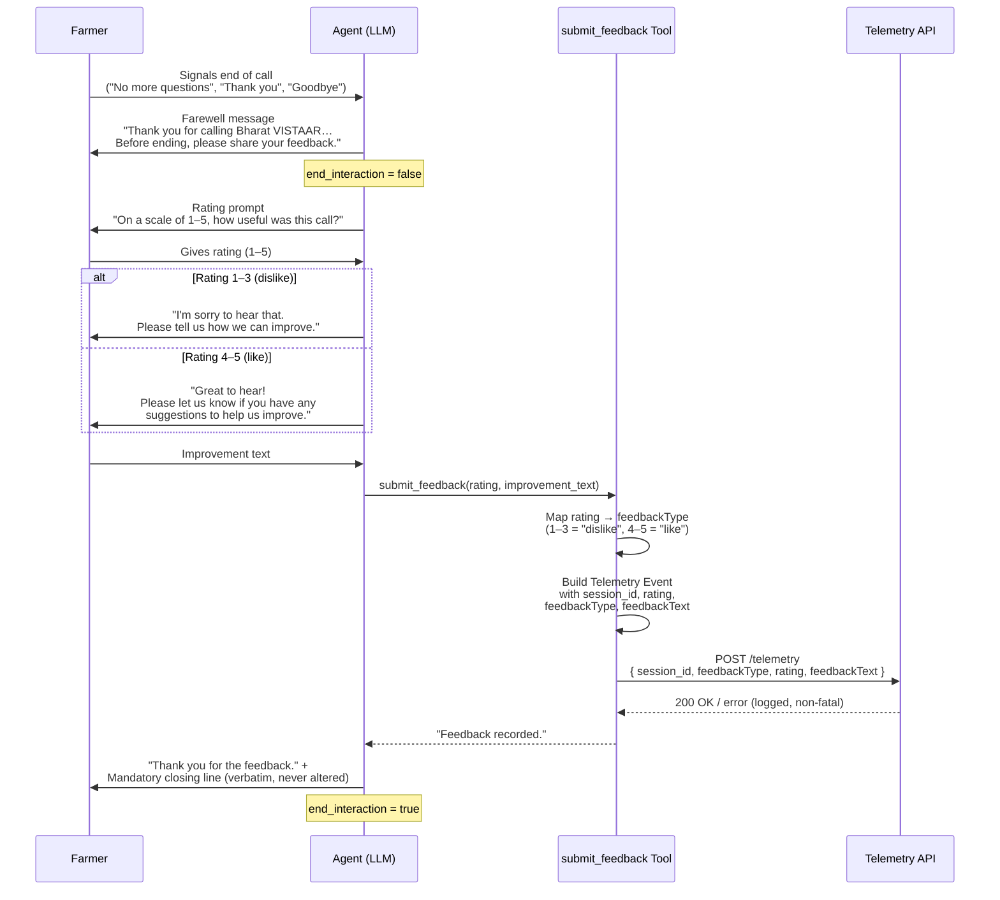

# Feedback Flow — Voice OAN API

```mermaid
sequenceDiagram
    participant Farmer
    participant Agent (LLM)
    participant submit_feedback Tool
    participant Telemetry API

    Farmer->>Agent (LLM): Signals end of call<br/>("No more questions", "Thank you", "Goodbye")
    Agent (LLM)->>Farmer: Farewell message<br/>"Thank you for calling Bharat VISTAAR…<br/>Before ending, please share your feedback."
    Note over Agent (LLM): end_interaction = false

    Agent (LLM)->>Farmer: Rating prompt<br/>"On a scale of 1–5, how useful was this call?"
    Farmer->>Agent (LLM): Gives rating (1–5)

    alt Rating 1–3 (dislike)
        Agent (LLM)->>Farmer: "I'm sorry to hear that.<br/>Please tell us how we can improve."
    else Rating 4–5 (like)
        Agent (LLM)->>Farmer: "Great to hear!<br/>Please let us know if you have any<br/>suggestions to help us improve."
    end

    Farmer->>Agent (LLM): Improvement text

    Agent (LLM)->>submit_feedback Tool: submit_feedback(rating, improvement_text)
    submit_feedback Tool->>submit_feedback Tool: Map rating → feedbackType<br/>(1–3 = "dislike", 4–5 = "like")
    submit_feedback Tool->>submit_feedback Tool: Build Telemetry Event<br/>with session_id, rating,<br/>feedbackType, feedbackText
    submit_feedback Tool->>Telemetry API: POST /telemetry<br/>{ session_id, feedbackType, rating, feedbackText }
    Telemetry API-->>submit_feedback Tool: 200 OK / error (logged, non-fatal)
    submit_feedback Tool-->>Agent (LLM): "Feedback recorded."

    Agent (LLM)->>Farmer: "Thank you for the feedback." +<br/>Mandatory closing line (verbatim, never altered)
    Note over Agent (LLM): end_interaction = true
```
