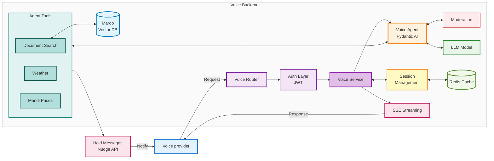

# Voice API Documentation

## Overview

The Voice API is an AI-powered agricultural assistant that provides real-time, streaming responses to agricultural queries. It supports multiple languages (Hindi, Marathi, English) and offers a wide range of agricultural services including weather forecasts, market prices, scheme information, and more.

**Base URL:**
`https://vistaar-dev.mahapocra.gov.in/api/voice`

## Endpoint

### GET `/api/voice/`

Streams AI-generated responses to agricultural queries in real-time.

**URL:** `https://vistaar-dev.mahapocra.gov.in/api/voice/`

**Method:** `GET`

**Content-Type:** `text/event-stream` (Server-Sent Events)

## Request Parameters

All parameters are passed as query string parameters:

| Parameter       | Type   | Required | Default             | Description                                                             |
| --------------- | ------ | -------- | ------------------- | ----------------------------------------------------------------------- |
| `query`       | string | Yes      | -                   | The user's agricultural question or query                               |
| `session_id`  | string | No       | Auto-generated UUID | Unique session identifier for maintaining conversation context          |
| `source_lang` | enum   | No       | `mr`              | Source language code:`hi` (Hindi), `mr` (Marathi), `en` (English) |
| `target_lang` | enum   | No       | `mr`              | Target language code:`hi` (Hindi), `mr` (Marathi), `en` (English) |

### Example Request

```bash
curl "https://vistaar-dev.mahapocra.gov.in/api/voice/?query=How%20to%20control%20pests%20in%20soybean&source_lang=en&target_lang=en&session_id=abc123"
```

## Response Format

The API returns a **Server-Sent Events (SSE)** stream with `Content-Type: text/event-stream`. The response is streamed in real-time as the AI generates the answer.

### Response Structure

The response is a continuous stream of text chunks. Each chunk represents a portion of the generated response.

**Example Response Stream:**

```
data: To control pests in soybean, you can use several methods...

data: First, identify the type of pest affecting your crop...

data: Common pests include aphids, whiteflies, and pod borers...
```

## Features and Capabilities

The Voice API agent has access to the following tools and capabilities:

### 1. **Document Search**

- Search agricultural documents and knowledge base
- Context-aware search based on user location and language

### 2. **Weather Services**

- **Weather Forecast**: Get weather forecasts for specific locations
- **Historical Weather**: Retrieve historical weather data

### 3. **Market Prices (Mandi)**

- Get current market prices for agricultural commodities
- Location-based price information

### 4. **Warehouse Information**

- Find nearby warehouses
- Get warehouse capacity and availability

### 5. **Geocoding Services**

- **Forward Geocoding**: Convert addresses to coordinates
- **Reverse Geocoding**: Convert coordinates to addresses

### 6. **Scheme Information**

- Search for government agricultural schemes
- Get detailed scheme information and eligibility criteria

### 7. **Agricultural Services**

- Find nearby agricultural service providers
- Get contact information for agricultural services

### 8. **Staff Contact**

- Get contact information for agricultural department staff
- Location-based staff directory

### 9. **Glossary/Terms Search**

- Search agricultural terminology and definitions
- Multilingual term explanations

## Language Support

The API supports three languages:

- **Hindi** (`hi`): हिंदी
- **Marathi** (`mr`): मराठी (Default)
- **English** (`en`): English

The system prompt and responses are automatically localized based on the `target_lang` parameter.

## Session Management

### Session ID

The `session_id` parameter is crucial for maintaining conversation context:

- **If provided**: The API retrieves previous messages in the conversation
- **If not provided**: A new UUID is generated automatically
- **Session TTL**: 24 hours (messages are cached for 24 hours)

### Conversation History

The API maintains conversation history automatically:

- Previous messages are included in context (up to 80,000 tokens)
- History is trimmed intelligently to fit within token limits
- Tool calls and responses are preserved for context

### Example: Multi-turn Conversation

```bash
# First message
curl "https://vistaar-dev.mahapocra.gov.in/api/voice/?query=What%20is%20the%20weather%20in%20Mumbai&session_id=session123"

# Follow-up message (uses previous context)
curl "https://vistaar-dev.mahapocra.gov.in/api/voice/?query=What%20about%20tomorrow&session_id=session123"
```

## Complete Example

### Request

```http
GET https://vistaar-dev.mahapocra.gov.in/api/voice/?query=How%20to%20control%20pests%20in%20soybean&source_lang=en&target_lang=en&session_id=abc123 HTTP/1.1
Host: vistaar-dev.mahapocra.gov.in
```

### Response

```http
HTTP/1.1 200 OK
Content-Type: text/event-stream
Transfer-Encoding: chunked

data: To control pests in soybean, you can use several integrated pest management (IPM) strategies:

data: 

data: 1. **Biological Control**: Introduce natural predators like ladybugs and lacewings...

data: 2. **Chemical Control**: Use recommended pesticides such as...

data: 3. **Cultural Practices**: Crop rotation, intercropping, and maintaining field hygiene...

data: 

data: For specific pest identification and treatment recommendations, please provide your location details.
```

## Error Handling

### Common Error Scenarios

1. **Invalid Language Code**

   - Ensure `source_lang` is one of: `hi`, `mr`, `en`
   - Defaults to `mr` if invalid
2. **Network Errors**

   - Implement retry logic with exponential backoff
   - Handle connection timeouts gracefully
3. **Stream Interruption**

   - Reconnect to the stream if connection is lost
   - Use the same `session_id` to maintain context

### Error Response Format

If an error occurs, the stream may include error information:

```
data: Error: [error message]
```

## Rate Limits

- **Default Rate Limit**: 1000 requests per minute (configurable)
- Implement client-side rate limiting to avoid hitting limits
- Use exponential backoff for retries

## Best Practices

### 1. Session Management

- Reuse `session_id` for related queries in the same conversation
- Generate a new `session_id` for new conversation topics
- Store `session_id` client-side for multi-turn conversations

### 2. Language Selection

- Set `source_lang` to match the user's input language
- Set `target_lang` to match the desired response language
- Both can be different (e.g., Hindi input → English output)

### 3. Streaming Handling

- Process chunks as they arrive for better UX
- Display partial responses to users in real-time
- Handle stream completion gracefully

### 4. Error Recovery

- Implement automatic reconnection for dropped connections
- Preserve `session_id` across reconnections
- Log errors for debugging

## Architecture

The following diagram illustrates the system architecture and flow:



### Components

- **Voice Vendor**: External voice service provider (RAYA) that sends requests and receives responses
- **Voice Router**: FastAPI router endpoint that handles HTTP requests, creates SSE streaming responses, and manages request routing
- **Auth Layer**: JWT authentication and authorization for secure API access
- **Voice Service**: Service layer that orchestrates session management, calls the voice agent, handles message history trimming/cleaning, and manages SSE streaming
- **Voice Agent**: Core AI agent powered by Pydantic AI with embedded moderation and LLM integration
- **Moderation**: Content moderation embedded within the voice agent
- **LLM Model**: Language model provider (OpenAI, Azure OpenAI, or vLLM) for generating responses
- **Agent Tools**: 10 specialized tools for agricultural services (Document Search, Weather Forecast/Historical, Mandi Prices, Warehouse Data, Geocoding, Scheme Info, Agri Services, Staff Contact, Terms Search)
- **Vector DB (Marqo)**: Vector database for semantic document search using hybrid search (vector + lexical)
- **Hold Messages**: Nudge messages sent to voice vendors during tool execution to keep users informed
- **Streaming**: Server-Sent Events (SSE) for real-time response streaming back to voice vendors, managed by Voice Service
- **Session Management**: Maintains conversation context and session state, handled by Voice Service layer
- **Redis Cache**: Storage for message history with 24-hour TTL and session data

## Technical Details

### Model Configuration

- **LLM Provider**: Configurable (OpenAI, Azure OpenAI, vLLM)
- **Max Tokens**: 8,192 tokens per response
- **Parallel Tool Calls**: Enabled
- **Retries**: 3 automatic retries on failure
- **End Strategy**: Exhaustive (agent uses all available tools as needed)

### Caching

- **Message History**: Cached in Redis with 24-hour TTL
- **Cache Key Format**: `{session_id}_SVA`
- **History Trimming**: Automatic trimming to 80,000 tokens max

### Architecture

- **Framework**: FastAPI
- **Agent Framework**: Pydantic AI
- **Streaming**: Server-Sent Events (SSE)
- **Cache**: Redis
- **Logging**: Structured logging with Logfire
