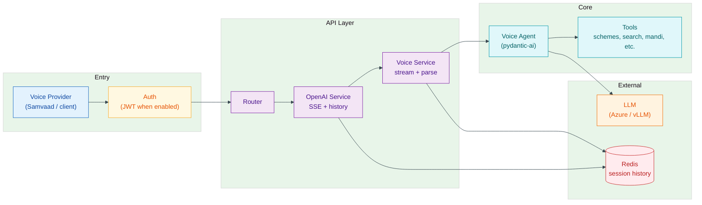
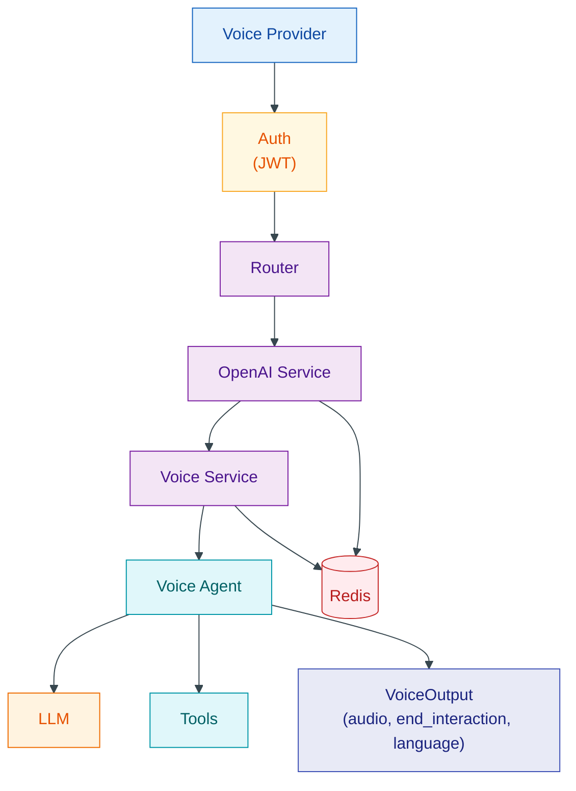
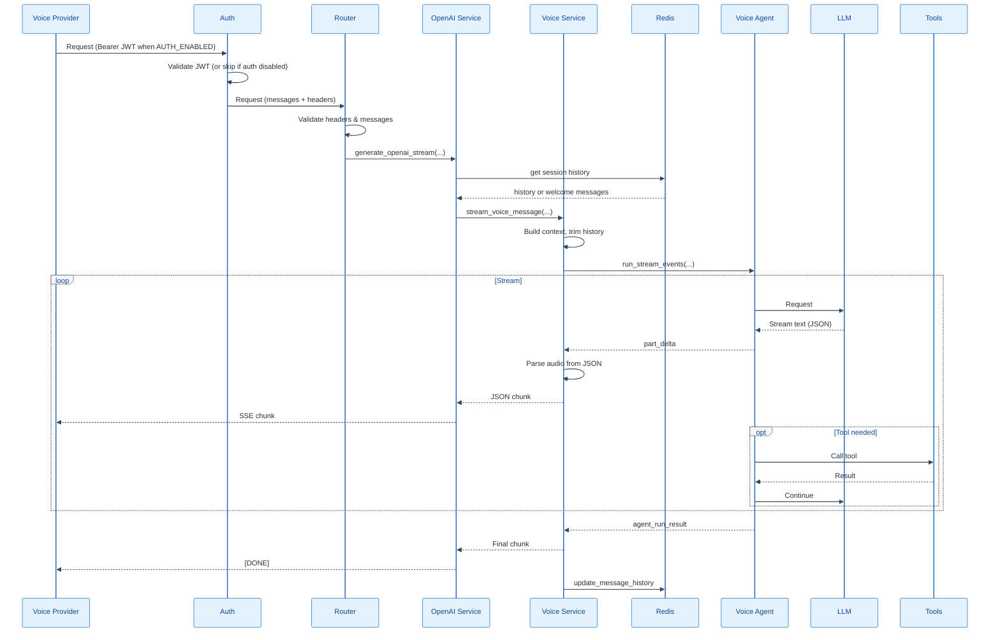

# Voice API – Architecture & Flow

## Components (simple)

| Component | What it does |
|-----------|----------------|
| **Voice Provider** | Client (e.g. Samvaad) that sends requests and plays TTS from streamed audio. |
| **Auth** | Optional JWT validation (Bearer token). When `AUTH_ENABLED` is true, request must include valid JWT. |
| **Router** | Receives POST (body: messages; headers: X-Tenant-ID, X-User-ID, X-Session-ID, X-Language), validates, forwards to OpenAI Service. |
| **OpenAI Service** | Loads/saves session history (Redis), calls Voice Service, wraps reply in OpenAI SSE format. |
| **Voice Service** | Builds context, trims history, runs agent stream; parses streaming JSON and yields `audio` chunks. |
| **Voice Agent** | LLM agent with system prompt (en/hi/other) and structured output (audio, end_interaction, language). |
| **Tools** | Scheme info, PM-Kisan, PMFBY, grievance, search, weather, mandi, commodity, feedback. |
| **LLM** | Azure OpenAI or vLLM (configurable). |
| **Redis** | Stores conversation history per session. |

---

## High-level architecture

## Request flow (streaming)

## File reference

| Component | File |
|-----------|------|
| App entry | `main.py` |
| Auth | `app/auth/jwt_auth.py`, `app/config.py` (AUTH_ENABLED) |
| Router | `app/routers/openai.py` |
| OpenAI Service | `app/services/openai_service.py` |
| Voice Service | `app/services/voice.py` |
| Session / history | `app/utils.py`, `app/core/cache.py` |
| Voice Agent | `agents/voice.py` |
| LLM config | `agents/models.py` |
| Tools | `agents/tools/__init__.py` + tool modules |

## Data flow (streaming)

- **Entry flow:** Voice Provider sends request → Auth validates JWT (when enabled) → Router receives request (body: messages; headers: X-Tenant-ID, X-User-ID, X-Session-ID, X-Language).
- **Each SSE chunk:** `delta.content` = full JSON: `{"audio": "...", "end_interaction": false, "language": "en"|"hi"|null}`. Voice provider uses latest chunk for TTS.
- **Session:** Stored in Redis as `{session_id}_SVA`; updated after each run.
